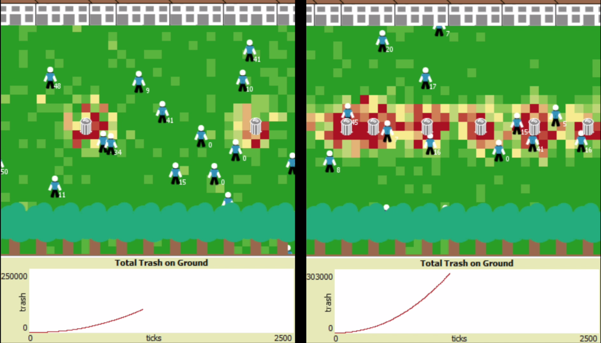

# trash-simulation

Won 3rd place at University Scholars' Datathon 2019

Built a multi-agent system with NetLogo to model the sociological behavior of people littering more frequently when there are more trash bins around. The results of my simulation confirms existing research about littering behavior.

